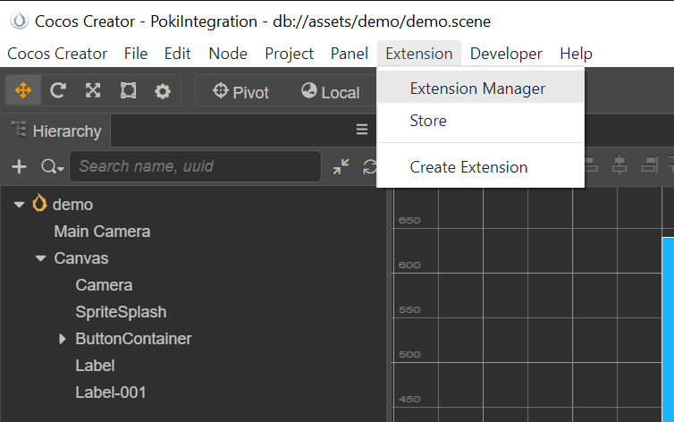
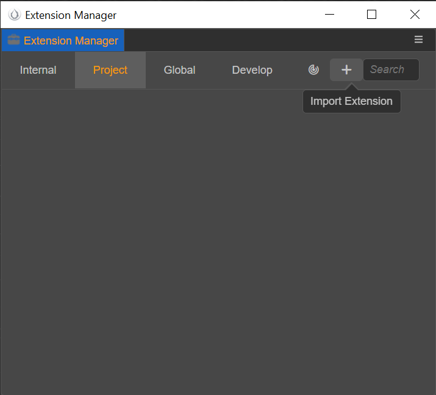
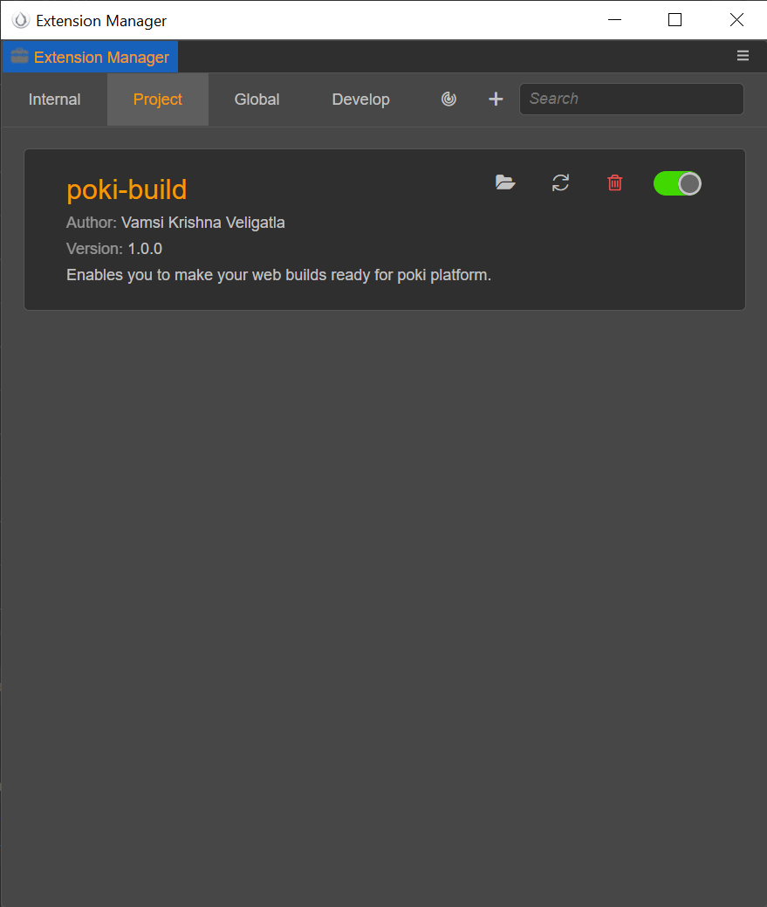
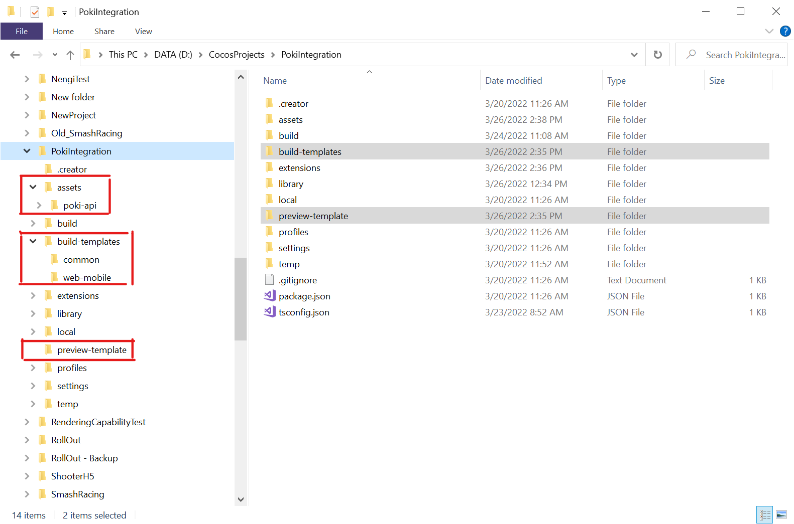

# Poki Extension for Cocos Creator 3.x
`Note: This extension works for CocosCreator3.4.0 and above only`

This extension is designed to help the integration of the [PokiSDK](https://sdk.poki.com/html5/) into your Cocos Creator(3.x) game. You can create a custom build and preview templates to do the integration by yourself, but the extension provides them ready to use. 

The extension provides:
- A preview template
- A web-mobile build template
- PokiSDK abstraction 
- A demo scene showcasing usage

Once you install and enable the extension, you will be able to test the PokiSDK integration in preview mode (in browser) and be able to make builds (web-mobile) that can be uploaded to poki platform. 

Please note that Poki is a curated platform, you will need to submit your game through pokifordevelopers.com first, and only work on the sdk integration after the game is approved .

## 1.Installation
There are two ways to download and install the extension

### Cocos Store
You can search and install the extension directly from the Cocos store.
This is the easiest way to get started.
//screenshots of the store and install process. 

### From Source/Release
Download the extension archive [poki-sdk-v1.1.zip](https://github.com/vkbsb/cocos-creator-poki-sdk/releases/download/v1.1/poki-sdk-v1.1.zip). 

Or download the source code as a zip file.  
``` 
git clone https://github.com/vkbsb/cocos-creator-poki-sdk
```

1. Once this is done, you can launch the extension manager in Cocos creator editor

2. Switch to the project tab and click on add extension button

3. Browse to the [poki-sdk-v1.1.zip](https://github.com/vkbsb/cocos-creator-poki-sdk/releases/download/v1.1/poki-sdk-v1.1.zip) file you have downloaded and click open. 


## 2.Enable extension
Once you have done the installation, go to the extension manager and ensure that the 
poki-build extension is enabled. 

1. Open the extension manager


2. Under project tab, ensure that poki-sdk is enabled. If it's not enabled, enable it. 



The extension creates the following files in your project directory.
- preview-template/index.ejs
- build-templates/common/application.ejs
- build-templates/web-mobile/index.ejs
- assets/poki-api/SiteLock.js
- assets/poki-api/PokiPlatform.ts
- assets/demo/demo.scene
- assets/demo/DemoScript.ts



## 3.Usage 
In your component scripts, you will be able to import CCPokiSDK and use it to interact with the PokiSDK. The following are the functions that are available for you to use from your game scripts. Checkout the DemoScript.ts for example usage.

```typescript
CCPokiSDK.gameplayStart() //-- in JS it's PokiSDK.gameplayStart()
CCPokiSDK.gameplayStop() //-- in JS it's PokiSDK.gameplayStop()
CCPokiSDK.commercialBreak() //-- in JS it's PokiSDK.commercialBreak()
CCPokiSDK.rewardBreak() //-- in JS it's PokiSDK.rewardedBreak()
CCPokiSDK.shareableURL(params, callback) //-- in JS it's PokiSDK.shareableURL({}).then(url => {})
local value = CCPokiSDK.getURLParam(key) //-- in JS it's PokiSDK.getURLParam('id')
```

You will notice that you do not see an equivalent to ``PokiSDK.setDebug(value)`` this is because the extension sets this automatically based on the build you make. 
```
________________________________________________________
| Build Type                  | PokiSDK Debug           |
|_____________________________|_________________________|
| Preview Build               | PokiSDK.setDebug(true) |
| web-mobile:Debug(checked)   | PokiSDK.setDebug(true) |
| web-mobile:Debug(un-checked)| PokiSDK.setDebug(false)|
---------------------------------------------------------
```

**Rewarded Break**

This ad type is used for optional rewarded actions, for example watching an ad video in exchange for in-game currency, a revive, a level skip... Here are the following steps you need to follow to implement it using this extension. 
- Register for a call back on `cc.game` for `EVENT_REWARD_BREAK_DONE`
- if `arguments[0] == true` we can give player reward, else don't reward.  

Check out [DemoScript.ts](./templates/demo/DemoScript.ts) for reference. 


**SiteLock**

Poki provides a sitelock code to the developers which helps ensure that the game is playable only on Poki's website. Please collect it from your dev contact. Once you get it, paste the code in the [SiteLock.js](./templates/poki-api/SiteLock.js) file at the appropriate location.


**Generate Build**

You will need to make ``web-mobile`` build for the extension to do the PokiSDK integration. 
#TODO screentshots for web-mobile web creation.