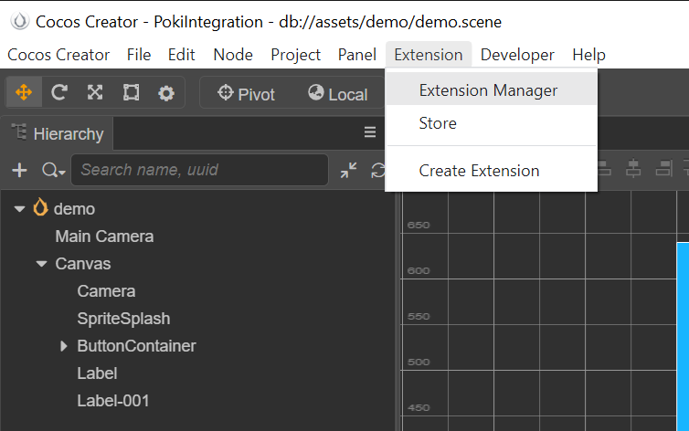
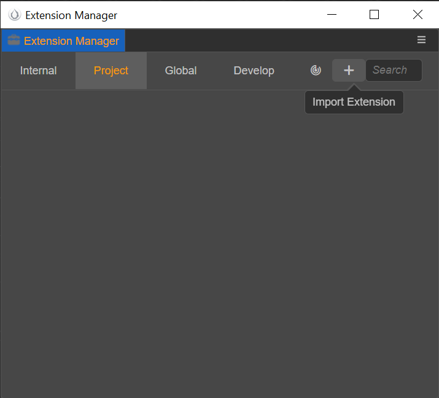
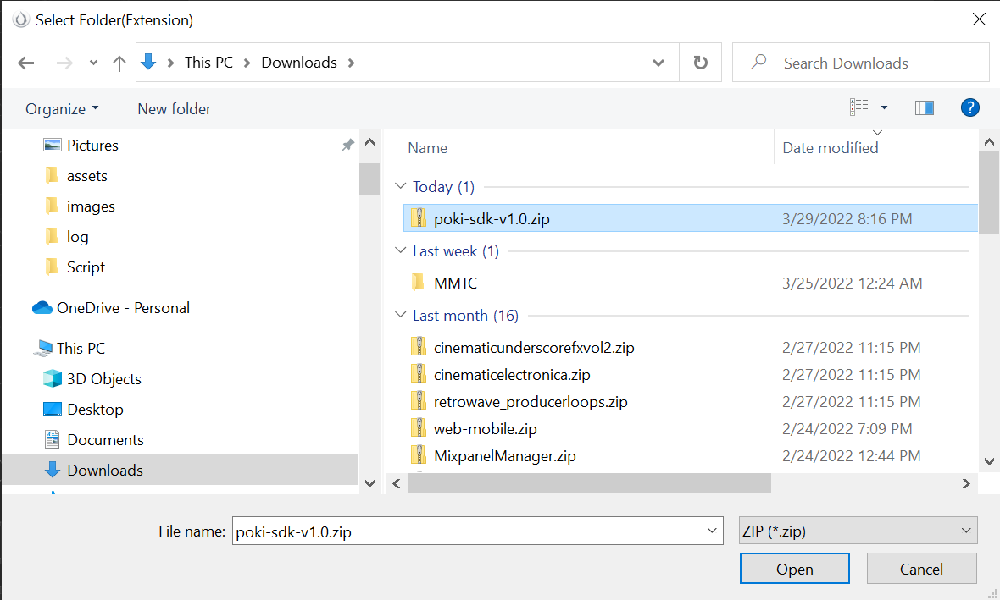
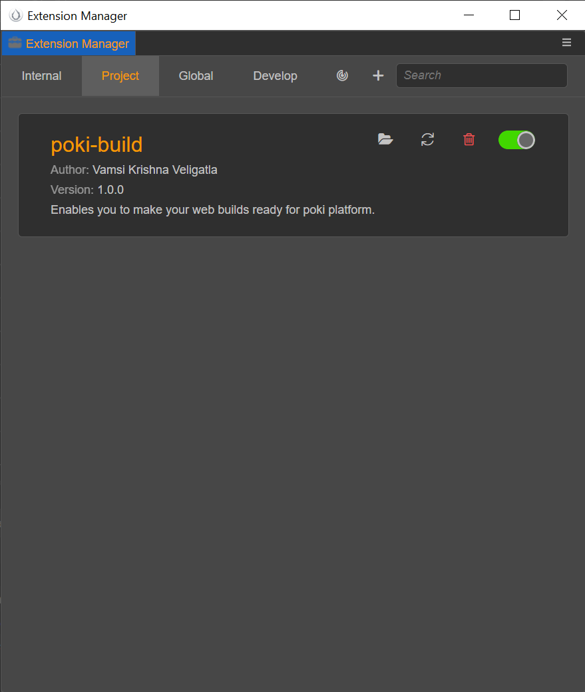
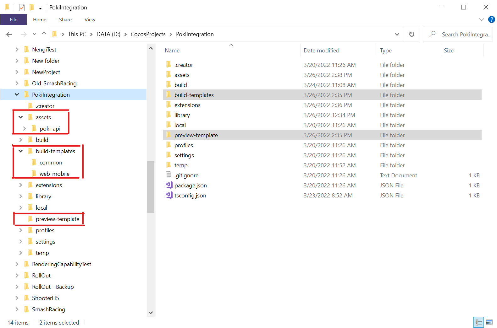
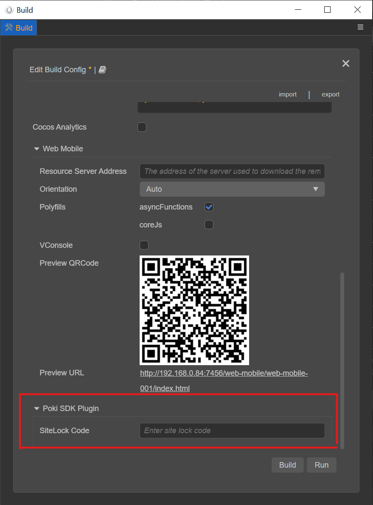
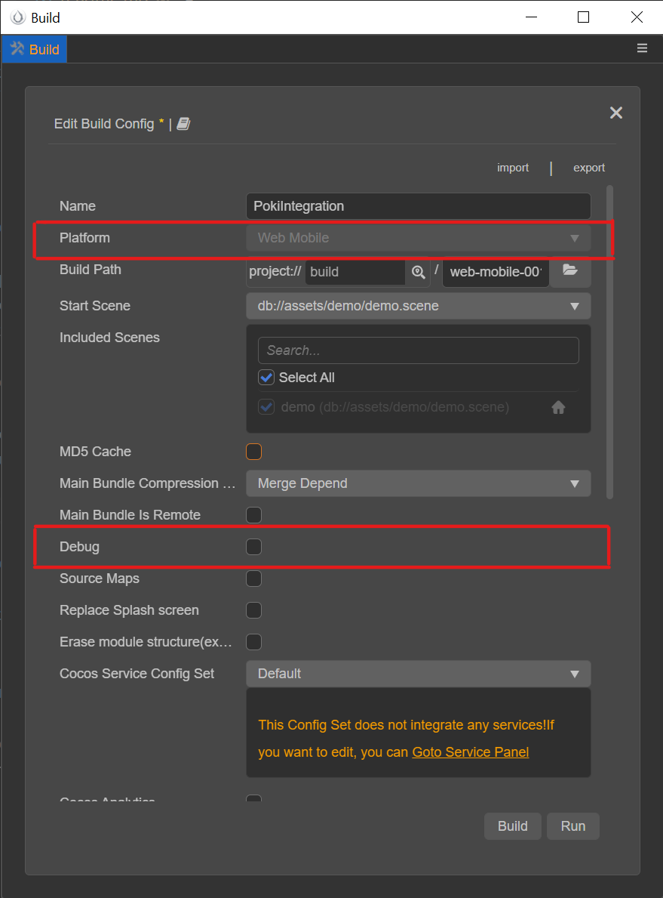

# Poki Extension for Cocos Creator 3.x
`Note: This extension works for CocosCreator3.4.0 and above only`

This extension is designed to help the integration of the [PokiSDK](https://sdk.poki.com/html5/) into your Cocos Creator(3.x) game. You can create a custom build and preview templates to do the integration by yourself, but the extension provides them ready to use. 

The extension provides:
- A preview template
- A web-mobile build template
- PokiSDK abstraction 
- A demo scene showcasing usage

Once you install and enable the extension, you will be able to test the PokiSDK integration in preview mode (in browser) and be able to make builds (web-mobile) that can be uploaded to poki platform. 

Please note that Poki is a curated platform, you will need to submit your game through pokifordevelopers.com first, and only work on the sdk integration after the game is approved .

## 1.Installation
There are two ways to download and install the extension

### Cocos Store
You can search and install the extension directly from the Cocos store.
This is the easiest way to get started.
//screenshots of the store and install process. 

### From Source/Release
Download the extension archive [poki-sdk-v1.2.2.zip](https://github.com/vkbsb/cocos-creator-poki-sdk/releases/download/v1.2.2/poki-sdk-v1.2.2.zip). 

Or download the source code as a zip file.  
``` 
git clone https://github.com/vkbsb/cocos-creator-poki-sdk
```

1. Once this is done, you can launch the extension manager in Cocos creator editor

2. Switch to the project tab and click on add extension button

3. Browse to the [poki-sdk-v1.2.2.zip](https://github.com/vkbsb/cocos-creator-poki-sdk/releases/download/v1.2.2/poki-sdk-v1.2.2.zip) file you have downloaded and click open. 



## 2.Enable extension
Once you have done the installation, go to the extension manager and ensure that the 
poki-build extension is enabled. 

1. Open the extension manager


2. Under project tab, ensure that poki-sdk is enabled. If it's not enabled, enable it. 



The extension creates the following files in your project directory.
- preview-template/index.ejs
- build-templates/common/application.ejs
- build-templates/web-mobile/index.ejs
- assets/poki-api/PokiPlatform.ts
- assets/demo/demo.scene
- assets/demo/DemoScript.ts



## 3.Usage
In your component scripts, you can import `CCPokiSDK` and use it as a thin wrapper around the Poki SDK. Checkout the [DemoScript.ts](./templates/demo/DemoScript.ts) for the legacy event-based flow.

```typescript
import { CCPokiSDK } from '../poki-api/PokiPlatform';

CCPokiSDK.gameplayStart();
CCPokiSDK.gameplayStop();

const rewardGranted = await CCPokiSDK.rewardedBreak({
  size: 'medium',
  onStart: () => {
    console.log('Rewarded ad started');
  },
});

await CCPokiSDK.commercialBreak(() => {
  console.log('Commercial break started');
});

const shareableUrl = await CCPokiSDK.shareableURL({ id: 'myid', type: 'mytype' });
const user = await CCPokiSDK.getUser(); // User | null

CCPokiSDK.openExternalLink('https://example.com');
CCPokiSDK.movePill(0, 24);
CCPokiSDK.measure('game', 'loading', 'start');

const value = CCPokiSDK.getURLParam('id');
const language = CCPokiSDK.getLanguage();
```

The preview and web-mobile templates initialize the Poki SDK automatically before your game runs, so the wrapper does not expose `CCPokiSDK.init()`.

The wrapper now exposes these direct methods:

- `rewardedBreak(onStart | params)`
- `commercialBreak(onStart)`
- `shareableURL(params)`
- `getURLParam(key)`
- `getLanguage()`
- `getUser()`
- `getToken()`
- `login()`
- `captureError(err)`
- `gameLoadingFinished()`
- `gameplayStart()`
- `gameplayStop()`
- `setDebug(toggle)`
- `setLogging(toggle)`
- `enableEventTracking(cmpIndex)`
- `openExternalLink(url)`
- `movePill(topPercent, topPx)`
- `measure(category, action, label, metadata?)`

Legacy compatibility is still preserved:

- `rewardBreak()` is still available and still emits `EVENT_REWARD_BREAK_DONE`.
- `commercialBreak()` still emits `EVENT_COMMERCIAL_BREAK_DONE`.
- `shareableURL()` still emits `EVENT_SHRABLE_URL_READY`.

You also do not need to call `PokiSDK.setDebug(value)` manually in the usual setup because the extension sets debug automatically based on the build you make.
```
________________________________________________________
| Build Type                  | PokiSDK Debug           |
|_____________________________|_________________________|
| Preview Build               | PokiSDK.setDebug(true) |
| web-mobile:Debug(checked)   | PokiSDK.setDebug(true) |
| web-mobile:Debug(un-checked)| PokiSDK.setDebug(false)|
---------------------------------------------------------
```

**Rewarded Break**

This ad type is used for optional rewarded actions, for example watching an ad video in exchange for in-game currency, a revive, a level skip.

If you prefer the legacy flow used by the demo scene:
- Register for a call back on `cc.game` for `EVENT_REWARD_BREAK_DONE`
- if `arguments[0] == true` we can give player reward, else don't reward

If you prefer the direct promise-based flow:

```typescript
const success = await CCPokiSDK.rewardedBreak({
  size: 'medium',
  onStart: () => {
    // pause audio or input here
  },
});

if (success) {
  // give reward
}
```

Check out [DemoScript.ts](./templates/demo/DemoScript.ts) for reference. 

**Template refresh**

The extension copies the Poki template files into your project only if the destination files do not already exist. If you update the extension in an existing game project, you may need to manually refresh:
- `preview-template/index.ejs`
- `build-templates/web-mobile/index.ejs`
- `assets/poki-api/PokiPlatform.ts`

**SiteLock**

Poki provides a sitelock code to the developers which helps ensure that the game is playable only on Poki's website. Please collect it from your dev contact. Once you get it, paste the code in the ``SiteLock`` field of the ``poki-sdk`` section of the ``web-mobile`` build. 



Please note that the sitelock code is embedded in the build only when you make a build with debug box un-checked. 



**Submit your game on Poki**

On [developers.poki.com](https://developers.poki.com/) you can submit your game with Poki. If we think your game is a good fit for our playground, we will reach out to you!
